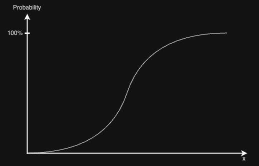

The text you're seeing is the **old** README content from the `main` branch — your view hasn't pulled the updated version yet. The updated README is committed on the PR branch (`vibe/update-readme-from-docs-1db1b7`), not merged to `main`.

Here is the full updated README content for you to paste directly:

---

# Exergy - Ore Grade Decrease Modeling

## Background
This work started by investigating the possibility of measuring the dissipation in LCA using exergy, specifically with the idea of thermodynamic rarity (TheRy), a concept developed by Antonio Valero and Alicia Valero. However, the TheRy model assumes all the dissipated resources go immediately to a concentration of the dead state, which is assumed to take place in a very long time horizon. This makes it difficult to quantify the short term impact of the life cycle of a product on the aspect of resource use accurately.

Therefore, the new attempt is to describe the impact of gradual resource dissipation of a product system in terms of exergy. To demonstrate the gradual resource dissipation process, the idea of ore-grade decrease is incorporated. The ore-grade-decrease model describes the relationship between the ore grade and the cumulative metal tonnage (CMT) extracted, and this decline is translated into an **Exergy Replacement Cost (ERC)** — the future effort required to compensate the extraction and dissipation of resources by a product system. The full theoretical framework is documented in [`docs/`](docs/).

## Setup
The entire LCIA process in this repository runs on [BrightWay2.5](https://learn.brightway.dev/en/latest/content/chapters/BW25/BW25_introduction.html). Check their documentation on how to install the package.  
Other libraries to be downloaded: `pubchempy`, `mendeleev` (see `requirements.txt`).

## Outline
Current work can be separated into 3 parts:
1. Modelling ore-grade decrease: this describes the relationship between the ore grade and the cumulative metal tonnage (CMT) that is extracted.
2. The corresponding exergy burden added to the future generation due to the change in ore concentration, expressed as an Exergy Replacement Cost (ERC).
3. Taking into account the concept of dissipation by considering the ratio between the dissipated resources versus the amount of extracted resources.

  

The image above illustrates clearly the impact pathway of the target indicator. In order to capture accurately the consequence of mineral dissipation on the reduction of ore grade, the two driving forces of the mining activity are identified, namely **retention** and **expansion**.
* **Retention** represents the amount needed to replenish the dissipated resources from the technosphere.
* **Expansion** refers to the extra amount that needs to be mined for the development of the society.

Take note that this indicator measures the future burden, in terms of exergy, for the retention part of the mining activity. An assumption made here is that the dissipated material will be replaced with the same material during the next life cycle, which means no alternative is considered.

## LCIA perspectives: Marginalist and Restorative
Following [`docs/cultural_perspectives.md`](docs/cultural_perspectives.md), the resource-impact formulations in this repository distinguish a **physical counterfactual** dimension that is orthogonal to the temporal/epistemic (Hierarchist–Egalitarian) distinction of ReCiPe:

* **Marginalist perspective** — the initial concentration $x_i$ is close to the final reference concentration $x_f$, so the impact is the *incremental* future burden caused by the product system marginally reducing the quality of the resource base:

$$ERC_{\mathrm{marginal}} = k\left[b_c(x_f)-b_c(x_{i,\mathrm{marginal}})\right]$$

> *What additional effort will future society need because the present product system has marginally reduced the quality of the resource base?*

* **Restorative perspective** — the initial state is the actual (very low) concentration $x_{i,\mathrm{dissipated}}$ of the resource after dissipation, so the impact is the effort required to restore the resource from its dissipated state to a useful reference concentration:

$$ERC_{\mathrm{restorative}} = k\left[b_c(x_f)-b_c(x_{i,\mathrm{dissipated}})\right]$$

> *What effort would be required to restore the resource from the state into which the product system has dissipated it to a useful reference concentration?*

In short:

$$\boxed{\text{Marginalist: future replacement of what has been appropriated}}$$

versus

$$\boxed{\text{Restorative: future restoration of what has been dissipated}}$$

The two-step LCIA calculation below corresponds to the **marginalist** workflow (Ore Grade Decline → ERC translation, documented in [`docs/method_marginalist.md`](docs/method_marginalist.md)), while the **restorative** workflow derives ERC characterization factors directly from the elementary-flow composition and the Valero ERC data, as documented in [`docs/restorative_LCIA_method.md`](docs/restorative_LCIA_method.md).

## Two-step LCIA framework
In brief, the marginalist LCIA calculation translates ore grade decline (OGD) into an exergy replacement cost (ERC) in two steps (see [`docs/method_marginalist.md`](docs/method_marginalist.md)):

1. **Ore Grade Decline (OGD) characterization** — find the ore-grade decline ($\Delta g$) that corresponds to the extraction/dissipation flow in the life cycle inventory (LCI). This yields the **Step-1 characterization factor** $CF1$.
    * unit of $CF1$: ore-grade decline per kg of elementary flow extracted/dissipated
2. **Exergy Replacement Cost (ERC) translation** — translate that ore-grade decline into a change in concentration exergy. This yields the **Step-2 characterization factor** $CF2$.
    * unit of $CF2$: MJ-Eq per kg of elementary flow

The final impact score is then obtained by multiplying the LCI flows by the relevant $CF$:

$$LCIA = \sum_{EF} \left( LCI_{amount,EF} \cdot CF_{EF} \right)$$

where $EF$ denotes an **elementary flow** in the biosphere database and $LCI_{amount,EF}$ is the amount of that flow per functional unit (kg).

### Step 1: Ore Grade Decline (OGD) characterization
Originally, ore-grade decrease was modelled with Lasky's relationship, connecting the ore grade ($g$) and the tonnage of rocks mined ($T$):

$$g=a-b\ln(T)$$

where $a$ and $b$ are constants that differ from mineral to mineral.

The choice of model was updated to the **log-logistic distribution** in the study by Vieira et al.

#### Original log-logistic distribution, $F(x)$
$$F(x)=\frac{1}{1+(\frac{x}{a})^{-b}}$$

#### Adapted for the distribution of ore grade, $H(g)$
$$H(g)=1-F(g)=1-\frac{1}{1+(\frac{x}{a})^{-b}}=\frac{1}{1+(\frac{x}{a})^{b}}$$

It is expressed in this form in the paper of Vieira:

$$H(g)=\frac{1}{1+e^{\frac{\ln(g)-\alpha}{\beta}}}$$

##### Derivation
$$\left(\frac{x}{a}\right)^{b}
=e^{\ln\left(\left(\frac{x}{a}\right)^{b}\right)}
=e^{b\ln\left(\frac{x}{a}\right)}
=e^{b(\ln{x}-\ln{a})}$$

$$ \text{let} \ \alpha=\ln{a}$$
$$ \text{let} \ \beta=\frac{1}{b}$$

We get:  $$e^{\frac{\ln(g)-\alpha}{\beta}}$$

To find the cumulative metal tonnage (CMT), we multiply the ore grade ($g$) by the ultimate amount of reserve ($A$):

$$CMT=\frac{A}{1+e^{\frac{\ln(g)-\alpha}{\beta}}}$$

Here, $\alpha$ represents the natural logarithm of the median ore grade, and $\beta$ is the scale parameter, which tells how spread out the concentration data is from the median, $e^{\alpha}$.

This statistical model better captures the global ore-grade vs. tonnage data.

##### Region 1
Region 1 represents the early stage of mining, where most of the ores have high concentration. This is where the independent variable, $g$, is high, and the dependent variable, CMT, is relatively low.
##### Region 2
Region 2 has the quickest ore-grade decline, with an almost steep linear relationship between the ore grade and the CMT.
##### Region 3
Region 3 is the scenario where the ore grade has become really low and CMT is really high. This models very well the reality of the high effort that needs to be invested in order to get the same amount of metal.

##### Ore Grade Decline factor (CF1) of Step 1
The pure-metal ore-grade-decline factor is the derivative of the ore grade with respect to the cumulative metal tonnage, computed from Vieira et al. as implemented in the notebook:

$$OGD_{Me} = CF1_{Me} = \frac{\partial g}{\partial CMT} = -\frac{A \cdot \beta \cdot e^{\alpha}}{CMT \cdot (A - CMT)} \left( \frac{A}{CMT} - 1 \right)^{\beta}$$

> **Note:** the notebook stores $CMT$ under the `CME` column and selects the resource quantity via `use_column` (one of `URR`, `A`, or `Rr`). **Gold (`Au`)** is explicitly excluded from the $CF1$ calculations due to mathematical inconsistencies where $CME > A$.

##### Elementary-flow characterization factor (CF1)
For each elementary flow ($EF$), the Step-1 characterization factor is the weighted sum of the metal-specific contributions, using the mass fraction $f_{EF,Me}$ of metal $Me$ in the elementary flow:

$$CF1_{EF,Me} = f_{EF,Me} \cdot OGD_{Me}$$

$$CF1_{EF} = \sum_{Me} CF1_{EF,Me} = \sum_{Me} \left( f_{EF,Me} \cdot OGD_{Me} \right)$$

The mass fraction $f_{EF,Me}$ is determined through a hierarchical composition-determination procedure (parse the flow name → PubChem API for compounds → pure-metal assumption → Valero fallback); see [`docs/method_marginalist.md`](docs/method_marginalist.md) §1.2 for the full priority table. Composition determination ensures $\sum_{Me} f_{EF,Me} \leq 1.0$.

Possible challenge with this $CF1$: because the curve is non-linear, the characterization factor is expected to change as the point of reference changes.

### Step 2: Connect ore-grade decrease with exergy (ERC translation)
Given the calculation of ERC in the framework of thermodynamic rarity, we compute the additional exergy by considering the initial mine concentration $x_i$ and the change in ore grade computed in Step 1.

The concentration exergy of a mineral grade $x$ is:

$$b_c(x)=-RT\left[\ln(x)+\frac{1-x}{x}\ln(1-x)\right]$$

where $R$ is the universal gas constant ($8.314 \times 10^{-6}$ MJ/(mol·K)) and $T$ is the temperature (298.15 K).

#### Mineral grade decline
The metal-specific ore-grade decline is first converted to a mineral-specific decline using the metal-to-mineral mass fraction $f_{Mineral,Me}$ (from `inputs/valero-constants.csv`):

$$\Delta g(LCIA)_{EF,Mineral} = \Delta g(LCIA)_{EF,Me} \cdot f_{Mineral,Me}$$

#### Initial and final ore grades
The initial ore grade $x_{i,Mineral}$ can be sourced (sensitivity analysis) from the Valero CSV, the Vieira CSV, or parsed directly from the elementary-flow name, controlled by the `input_for_xi` parameter. The final ore grade is:

$$x_{f, EF, Mineral} = x_{i, Mineral} - \Delta g(LCIA)_{EF,Mineral}$$

with validation that $x_{f, EF, Mineral} > 0$.

#### Exergy Replacement Cost (CF2)
The ERC for the elementary flow is:

$$ERC_{EF,Metal} = CF2_{EF,Me} = \frac{b_c(x_{f, EF, Mineral}) - b_c(x_{i, Mineral})}{b_c(x_{i, Mineral}) - b_c(x_{r, EF, Mineral})} \cdot E_{Valero} \cdot \left( \frac{x_{f, Me}}{x_{i, Me}} \right)^{-0.5}$$

where $x_r$ is the refining mineral ore grade and $E_{Valero}$ is the total energy to mine and concentrate the mineral (both from `inputs/valero-constants.csv`). The elementary-flow characterization factor aggregates the metal contributions with the same mass fractions $f_{EF,Me}$:

$$CF2_{EF} = \sum_{Me} \left( f_{EF,Me} \cdot CF2_{EF,Me} \right)$$

### Final LCIA score
The final (marginalist) ERC-based impact score multiplies the LCI flows by the Step-2 characterization factor:

$$LCIA_{ERC} = \sum_{EF} \left( LCI_{amount,EF} \cdot CF2_{EF} \right)$$

This represents the total exergy replacement cost for the product system (MJ-Eq per functional unit). Depending on the selected `focus`, the LCI flows are taken either from extraction (**Input-based** accounting, `focus="natural_resources"`) or from dissipation (**Dissipation-based** accounting, `focus="dissipation"`).

## Restorative perspective
The **restorative** LCIA method (`docs/restorative_LCIA_method.md`) does not perform the two-stage OGD → ERC translation above. Instead, it derives ERC characterization factors **directly** from the elementary-flow composition and the Valero ERC dictionary `valero_rarity_data`, reusing the same `flow_compositions` table (stoichiometric compositions retained):

$$CF_{EF}^{ERC} = \sum_{Me} f_{EF,Me} \cdot ERC_{Me}$$

It is registered as the Brightway method `Cumulative Exergy Replacement Cost (E)`, in contrast to the marginalist method `Cumulative Exergy Replacement Cost (H)`. The methodological chain is:

$$\text{Valero ERC data} + \text{Elementary-flow composition} \rightarrow \text{ERC characterization factors} \rightarrow \text{Brightway LCIA method} \rightarrow \text{Restorative LCIA score}$$

## Configuration parameters
The notebook `SurplusEx.ipynb` is parameterised to test scenarios via the `parameter_code` string `{pc1}{pc2}{pc3}{pc4}`:

| Parameter | Values | Meaning |
|---|---|---|
| `viera_data` (`pc1`) | `a` / `b` | Vieira data version (`old` / `new`) |
| `input_for_xi` (`pc2`) | `1` / `2` / `3` | Initial ore grade source: Vieira CSV / Valero CSV / elementary-flow name |
| `focus` (`pc3`) | `i` / `ii` | LCI accounting approach: `natural_resources` (Input-based) / `dissipation` (Dissipation-based) |
| `apply_ogd` (`pc4`) | `y` / `n` | Whether to compute and apply the OGD characterization factors to all natuarl resource elementary flows, (e.g., even minerals as Clay that PubChem attriute a concentration of Al of 0.33 (formula given to Clay: Al2SiO5)) |

> `input_for_xi="elementary_flow"` (option 3) is only valid for `focus="natural_resources"`, since dissipation flows carry no ore-grade-decline signal.

## Inputs
- `inputs/sop-vieira-constants_{old,new}.csv` — Vieira et al. data: $A$, `CME` (CMT), $\alpha$, $\beta$ per metal.
- `inputs/valero-constants.csv` — Valero rarity data: $x_m$, $x_r$, $E_{Valero}$, `ERC[MJ/kg]` per mineral.
- `pubchem_cache/` — cached PubChem molecular-formula lookups used to compute $f_{EF,Me}$ for compound flows.

---

That's the complete updated file. It lives on PR [#3](https://github.com/LouisFreboeuf/Exergy-Ore-Grade-Decrease-Model/pull/3); to see it in the repo directly you'd need to either merge the PR or view the branch `vibe/update-readme-from-docs-1db1b7`.